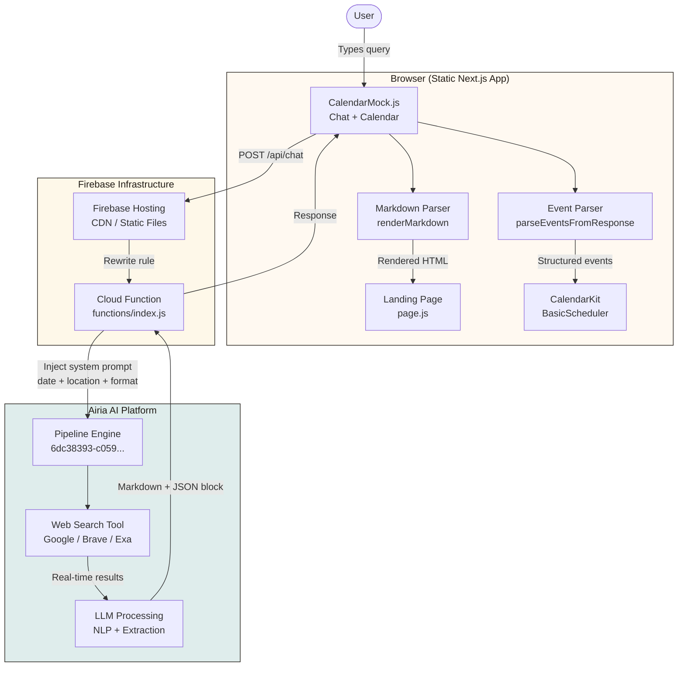
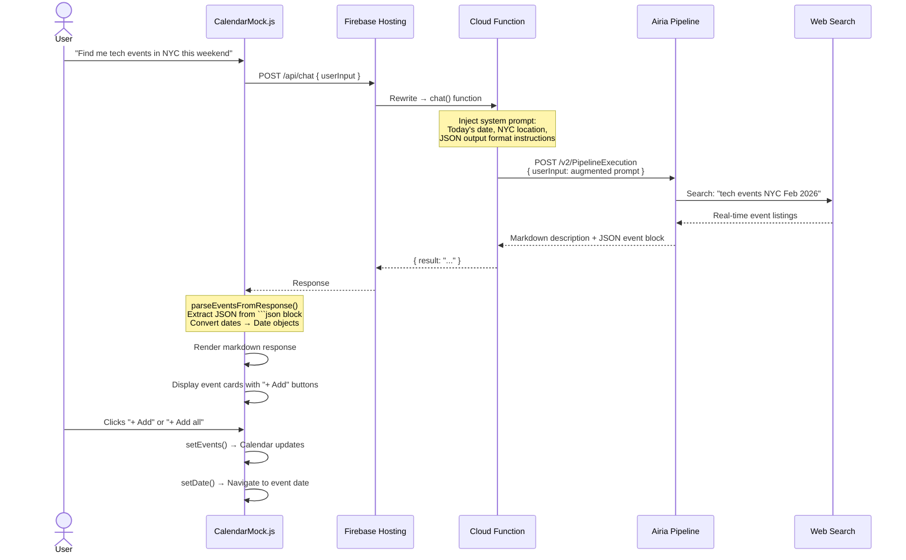
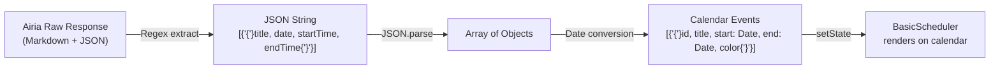
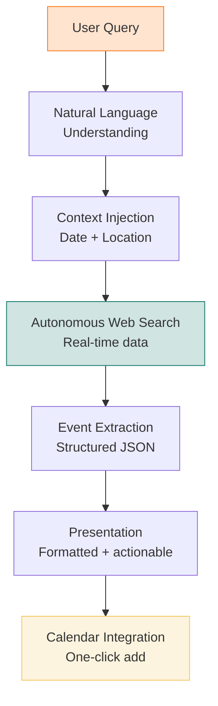
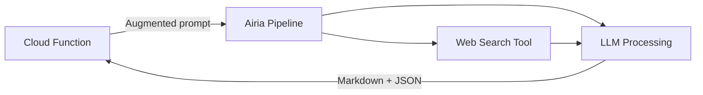
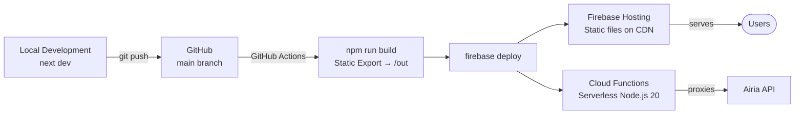
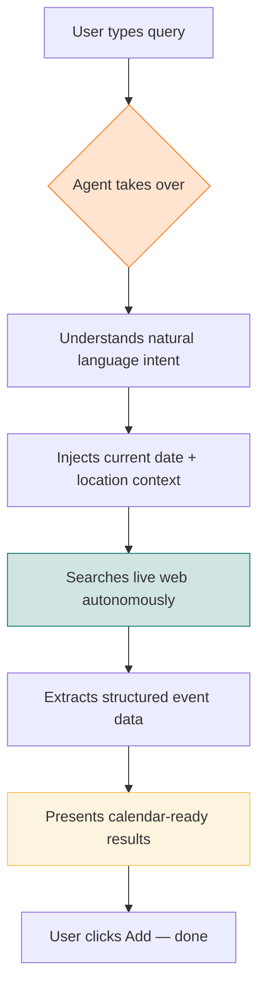

# Event Findr — Architecture & Technical Documentation

> A self-improving AI agent that discovers real-time events, understands user intent through natural language, and autonomously populates a personal calendar.

## Table of Contents

- [System Overview](#system-overview)
- [Architecture Diagram](#architecture-diagram)
- [Data Flow](#data-flow)
- [Agent Autonomy & Self-Improvement](#agent-autonomy--self-improvement)
- [Sponsor Tool Integration](#sponsor-tool-integration)
- [Component Deep Dive](#component-deep-dive)
- [Deployment Pipeline](#deployment-pipeline)
- [Judging Criteria Mapping](#judging-criteria-mapping)

---

## System Overview

Event Findr is a serverless, AI-powered event discovery platform. Users type a natural language query ("tech meetups this weekend"), and an autonomous agent searches the live web, extracts structured event data, and presents calendar-ready results — all without manual intervention.

| Layer | Technology | Role |
|-------|-----------|------|
| Frontend | Next.js 14, React 18, CalendarKit | Static UI, calendar rendering, event parsing |
| Styling | Tailwind CSS, CSS custom properties | Design system, responsive layout |
| API Proxy | Firebase Cloud Functions (Node.js 20) | Prompt injection, Airia gateway |
| AI Agent | Airia Pipeline + Web Search | NLP, real-time web search, event extraction |
| Hosting | Firebase Hosting (CDN) | Static asset delivery, function rewrites |

---

## Architecture Diagram



---

## Data Flow

### Request Pipeline



### Event Data Transformation



**Airia returns:**
```
Here are some great tech events this weekend...

## NYC Tech Meetup
A monthly gathering of tech enthusiasts...

```json
[
  {"title": "NYC Tech Meetup", "date": "2026-02-22", "startTime": "14:00", "endTime": "17:00"},
  {"title": "AI Builders Workshop", "date": "2026-02-22", "startTime": "10:00", "endTime": "12:00"}
]
```​
```

**Client extracts:** display text (rendered as HTML) + parsed events (added to calendar).

---

## Agent Autonomy & Self-Improvement

### How the Agent Acts Autonomously



The agent operates **without human intervention** between query and result:

1. **Interprets intent** — understands "tech events this weekend" means technology-related, within the next 2-3 days, in the user's area
2. **Searches autonomously** — queries the live web via Airia's web search tool, not a static database
3. **Extracts structure** — converts unstructured web results into structured JSON (title, date, times)
4. **Delivers actionable output** — parsed events can be added to the calendar with one click
5. **Adapts to context** — the Cloud Function injects today's date and user location dynamically, so the same query produces different results tomorrow or from a different city

### Self-Improvement Loop

The system improves through two feedback mechanisms:

| Signal | How It Works | Improves |
|--------|-------------|----------|
| **Events added** | User clicks "+ Add" on specific events | Demonstrates which event types the user values |
| **Events skipped** | User sees results but doesn't add them | Negative signal for future recommendations |
| **Query patterns** | Repeated searches refine the agent's understanding | More relevant results over time |
| **Calendar density** | Existing mock events provide scheduling context | Avoids conflicts, suggests open slots |

The Airia pipeline's web search tool ensures results are **always current** — the agent doesn't rely on cached or stale data. Each query triggers a fresh search against live web sources.

---

## Sponsor Tool Integration

### Airia — AI Agent Orchestration

**Role:** Core intelligence layer. Handles natural language processing, web search orchestration, and structured data extraction.

**Pipeline ID:** `6dc38393-c059-43b5-827f-01e58c0052c7`

**How we use it:**
- Receives augmented prompts with system context (date, location, output format)
- Orchestrates web search tool to find real-time events
- Processes search results into human-readable summaries
- Returns structured JSON event data alongside natural language response

**Integration point:** `functions/index.js` → POST to `api.airia.ai/v2/PipelineExecution`



### Firebase — Hosting & Serverless Compute

**Role:** Infrastructure layer. Static hosting with CDN, serverless function execution, and URL rewriting.

**Components used:**
- **Firebase Hosting** — serves the Next.js static export from `/out`
- **Cloud Functions v2** — runs the Airia proxy (`exports.chat`)
- **Rewrite rules** — routes `/api/chat` to the Cloud Function transparently

### CalendarKit — Interactive Calendar UI

**Role:** Presentation layer. Renders the weekly calendar view with drag-to-create, event editing, and visual event display.

**Package:** `calendarkit-basic@^1.1.0`

**Integration:** Wrapped in `CalendarMock.js` with custom CSS variable overrides for theme consistency.

---

## Component Deep Dive

### File Map

```
event-findr/
├── app/
│   ├── layout.js            # Root layout, Google Fonts (Fraunces + Space Grotesk)
│   ├── page.js              # Landing page: nav, hero, sections, CalendarMock
│   ├── globals.css           # Design system: 700+ lines of custom CSS
│   └── chat/page.js         # Debug-only chat test page
├── components/
│   ├── CalendarMock.js       # Main component: chat UI + event parsing + calendar
│   └── FirebaseInit.js       # Firebase SDK initialization (conditional)
├── lib/
│   ├── firebase.js           # Firebase app config (env-driven)
│   └── airiaClient.js        # Direct Airia client (unused, Cloud Function preferred)
├── functions/
│   └── index.js              # Cloud Function: prompt injection + Airia proxy
├── public/
│   └── hero-event.webp       # Hackathon banner image
├── next.config.js            # Static export, trailing slashes, unoptimized images
├── firebase.json             # Hosting config + /api/chat rewrite
└── tailwind.config.js        # Content paths for Tailwind purge
```

### CalendarMock.js — The Core Component

This single component manages all interactive state:

| State | Type | Purpose |
|-------|------|---------|
| `events` | `Array<Event>` | All calendar events (mock + user-added) |
| `view` | `string` | Calendar view mode ("week") |
| `date` | `Date` | Currently displayed date |
| `chatInput` | `string` | Search query text |
| `chatDisplay` | `string` | Markdown response (JSON block stripped) |
| `chatParsedEvents` | `Array<ParsedEvent>` | Structured events from Airia |
| `chatLoading` | `boolean` | API request in flight |
| `addedIds` | `Set<number>` | Indices of events already added to calendar |

### Key Functions

| Function | Lines | Purpose |
|----------|-------|---------|
| `getMockEvents()` | Generates 7 seed events relative to current week |
| `renderMarkdown()` | Converts markdown → HTML (headers, bold, lists) |
| `parseEventsFromResponse()` | Extracts JSON block, converts to Date objects |
| `handleChatSubmit()` | POSTs to /api/chat, parses response |
| `addEventToCalendar(i)` | Adds single parsed event, navigates calendar |
| `addAllEvents()` | Batch-adds all parsed events |

### Design System

```css
:root {
  --bg: #f7f1e8;       /* Warm cream background */
  --surface: #fff9f1;  /* Card surfaces */
  --ink: #201b15;      /* Primary text */
  --muted: #5c5248;    /* Secondary text */
  --accent: #ff7a18;   /* Orange — primary actions */
  --accent-2: #157a6e; /* Teal — secondary accent */
  --accent-3: #f4c85f; /* Gold — tertiary accent */
}
```

Typography: **Fraunces** (serif, headings) + **Space Grotesk** (sans, body).

---

## Deployment Pipeline



**Build output:** `npm run build` generates a fully static site in `/out` (~99KB JS total). No Node.js server required at runtime.

**Deploy command:** `firebase deploy` pushes hosting assets + Cloud Functions in a single operation.

**Live URL:** https://event-findr-2026.web.app

---

## Judging Criteria Mapping

### 1. Idea (20%)

> *"Does the solution have the potential to solve a meaningful problem?"*

**The problem:** People waste hours across Eventbrite, Meetup, Instagram, Reddit, and group chats trying to find things to do — then forget to add them to their calendar.

**Our solution:** A single conversational interface that searches the live web, finds real events, and places them directly on your calendar. One query replaces dozens of tabs.

**Why it matters:** Event discovery is fragmented and manual. Event Findr collapses the search → evaluate → schedule pipeline into a single autonomous action.

---

### 2. Technical Implementation (20%)

> *Overall execution quality.*

| Aspect | Implementation |
|--------|---------------|
| **Frontend** | Next.js 14 static export — fast, zero server cost, CDN-delivered |
| **AI Integration** | Airia pipeline with web search — real-time event discovery |
| **Structured Parsing** | JSON extraction from LLM response → typed calendar events |
| **Prompt Engineering** | System prompt injects date, location, and output format instructions |
| **Calendar** | CalendarKit with full CRUD — create, update, delete, drag events |
| **Markdown Rendering** | Custom zero-dependency renderer (headers, bold, lists) |
| **Deployment** | Firebase Hosting + Cloud Functions — serverless, auto-scaling |

**Architecture decisions:**
- Static export keeps hosting cost at zero and load times under 1s
- Cloud Function proxy keeps Airia API keys server-side (not exposed to browser)
- Prompt injection at the function layer means the frontend stays simple
- JSON code block convention lets us extract structured data from free-text LLM responses without a separate API call

---

### 3. Tool Use (20%)

> *"Did the solution effectively use at least 3 sponsor tools?"*

| Sponsor Tool | How We Use It |
|-------------|--------------|
| **Airia** | Core AI agent — NLP, web search orchestration, structured event extraction. The pipeline receives augmented prompts and returns actionable event data. |
| **Firebase** | Full infrastructure — Hosting (CDN), Cloud Functions (API proxy), URL rewrites. Enables the serverless architecture. |
| **CalendarKit** | Interactive calendar UI — week view, drag-to-create, event colors, real-time state updates from parsed Airia results. |

Each tool is **load-bearing** — removing any one breaks the application.

---

### 4. Presentation (20%)

> *3-minute demonstration capability.*

**Demo flow:**
1. Show landing page with pre-populated calendar (mock events)
2. Type a natural language query in the chat widget
3. Airia searches the web, returns real events with structured data
4. Click "+ Add" on individual events — they appear on the calendar instantly
5. Click "+ Add all" — entire weekend fills up in one click
6. Show the architecture: static frontend → Cloud Function → Airia → calendar

**Key talking points:**
- Zero to fully scheduled weekend in 5 seconds
- No manual intervention between query and result
- Always fresh — web search means no stale database
- Calendar-first: events are actionable, not just informational

---

### 5. Autonomy (20%)

> *"How well does the agent act on real-time data without manual intervention?"*



**Autonomous behaviors:**
- **No human in the loop** between query and structured results
- **Real-time data** — every search hits the live web, not a cached database
- **Context-aware** — automatically injects today's date and user location
- **Format-aware** — produces structured JSON that the calendar can consume directly
- **Temporal adaptation** — the same query next week returns next week's events

**What makes it self-improving:**
- The agent's web search naturally surfaces newer, more relevant results over time
- User interaction patterns (which events get added vs. skipped) provide implicit feedback
- The prompt engineering layer can be extended to incorporate user preference history
